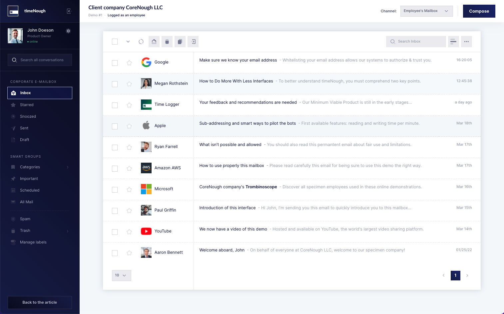
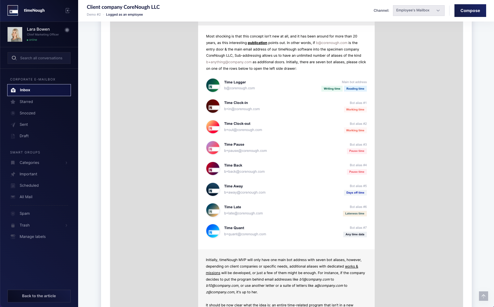
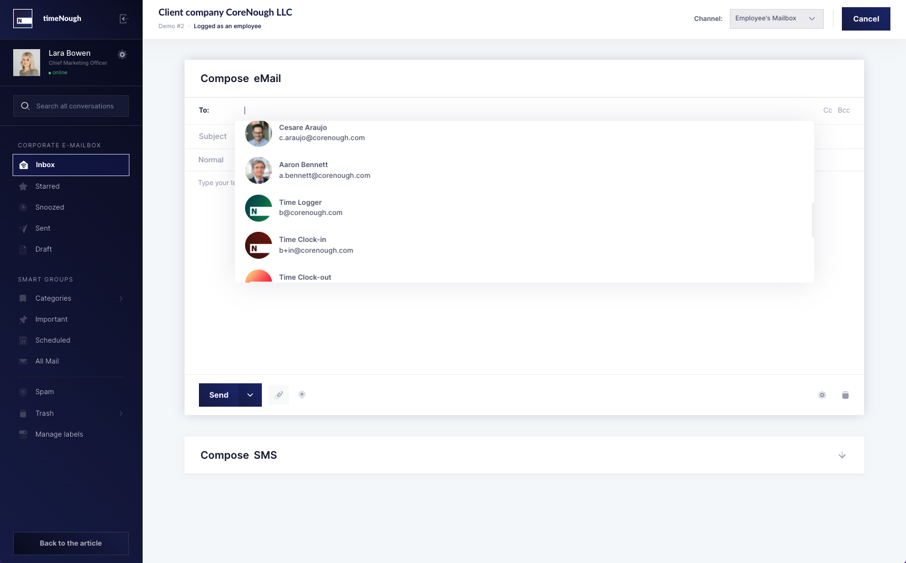
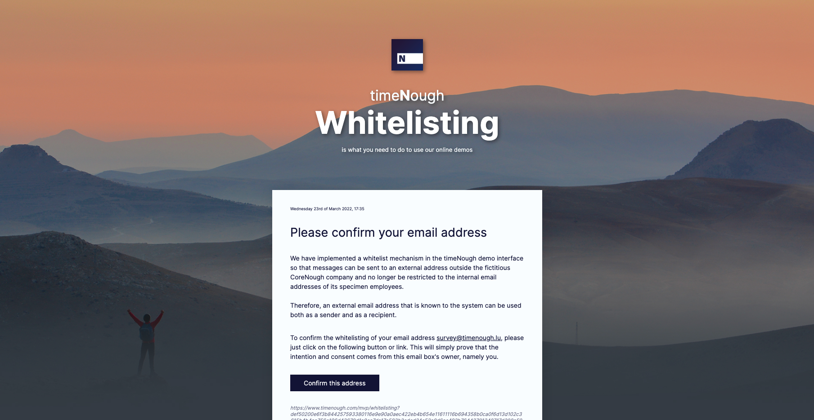
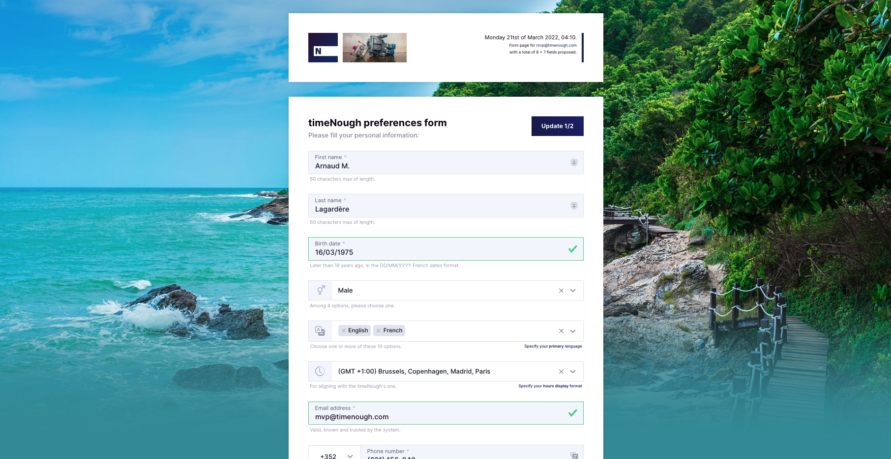

# timeNough's MVP

[](https://gitter.im/timenough/Lobby?utm_source=badge&utm_medium=badge&utm_campaign=pr-badge&utm_content=badge)

The project let's people test and see in action the Minimum Viable Product of the enterprise software dedicated to employee time tracking and monitoring called timeNough.

> Live [demo #1](https://www.timenough.com/demo/mailboxes/2.l.bowen) and [demo #2](https://www.timenough.com/demo/mailboxes/1.j.doeson).

## Table of Contents
* [General Info](#general-information)
* [Technologies Used Backend](#technologies-used-backend)
* [Technologies Used Frontend](#technologies-used-frontend)
* [Features](#features)
* [Screenshots](#screenshots)
* [Setup](#setup)
* [Project Status](#project-status)
* [Contact](#contact)
* [License](#license)


## General Information
- The purpose of timeNough is to increase the comfort and the trust of time tracking and monitoring activities performed in corporate environments, by reducing the number of interfaces that employees need to use or handle as much as possible.
- The main and unavoidable interface common employees are dealing with it the email mailbox, based on timeNough founders assumption, and the MVP will focus on email messages and signals an employee, a user or tester can send to an internal email address that will act like an open door to the software, a way to pilot it, send him requests, commands, etc.
- Unique Selling Proposition: _Less interface, better flow_.


## Technologies Used (backend)
- PHP • version [7.4.21](https://www.php.net/ChangeLog-7.php#7.4.21)
- PHPMailer • version [6.5](https://github.com/PHPMailer/PHPMailer)
- Defuse php-encryption • version [2.3.1](https://github.com/defuse/php-encryption)
- Mailchimp Marketing • version [3.0.74](https://github.com/mailchimp/mailchimp-marketing-php)
- Twilio-php • version [6.28](https://github.com/twilio/twilio-php)
- Deepl-php-lib • version [3.0.1](https://github.com/Baby-Markt/deepl-php-lib)
- Google Cloud Translation for PHP • version [1.12](https://github.com/googleapis/google-cloud-php-translate)
- CryptoJS 3.x AES encryption/decryption • version [2.1.1](https://github.com/brainfoolong/cryptojs-aes-php)
- Datawrapper Core • version [latest](https://github.com/datawrapper/datawrapper)
- Token Bucket • version [2.0](https://github.com/bandwidth-throttle/token-bucket)


## Technologies Used (frontend)
- Bootstrap • version [5.1](https://getbootstrap.com/docs/5.1/getting-started/introduction/)
- jQuery • version [3.6.0](https://blog.jquery.com/2021/03/02/jquery-3-6-0-released)
- DataTables • version [1.11.5](https://datatables.net/download/)
- Select2 • version [4.0.13](https://github.com/select2/select2/releases)
- Tagify • version [4.9.8](https://github.com/yairEO/tagify)
- SweetAlert • version [11.4.6](https://github.com/sweetalert2/sweetalert2)
- Vis-timeline • version [7.5.1](https://github.com/visjs/vis-timeline)
- FormValidation • version [latest](https://github.com/form-validation/form-validation)
- Date Range Picker • version [3.1](https://github.com/dangrossman/daterangepicker)


## Features
- Sending email signals to the program for Clock-in purpose
- Sending SMS signals to the program for Clock-in purpose
- Sending email signals to the program for Clock-out purpose
- Sending SMS signals to the program for Clock-out purpose
- Sending email signals to the program for measuring the pause time
- Sending SMS signals to the program for measuring the pause time
- Sending email signals to the program for indicating that the employee will be late at an event
- Sending SMS signals to the program for indicating that the employee will be late at an event
- Sending email signals to the program for making a leave request plugged in to the company's HR system
- Sending SMS signals to the program for making a leave request plugged in to the company's HR system
- Sending email signals to the program for consulting and retrieving all data in charts about time tracking
- Sending SMS signals to the program for consulting and retrieving all data in charts about time tracking


## Screenshots







## Setup
- The demo files are essentially .html files, they can be viewing directly or by hosting the entire __/demo/__ folder into an effective webserver or http://localhost.
- The files of the __/mvp/__ folder are PHP language based with dependencies that should be retrieved via [PHP composer](https://getcomposer.org/) and the .phar file available:

    ```
    cd mvp
    rm -Rf sources/php/composer.lock sources/php/vendor
    COMPOSER=sources/php/composer.json COMPOSER_VENDOR_DIR=sources/php/vendor php sources/php/composer.phar install
    rm -Rf sources/php/composer.lock sources/php/additional/vendor
    COMPOSER=sources/php/additional/composer.json COMPOSER_VENDOR_DIR=sources/php/additional/vendor php sources/php/composer.phar install
    ```
- The content of the `/.env` file (at the root) is __really__ important otherwise a lot of dependencies, once retrieved will not work properly. It contains all text keys, API keys and sensitive data so please ask to a developer already involved in the project to give you the content securely.

## Project Status
Project is: _in progress_ at the date of Friday, March 25th, 2022.


## Contact
Created by [@timenough](https://github.com/timenough) - feel free to contact the dev. team!


## License

[![CC BY-NC-SA 4.0][cc-by-nc-sa-shield]][cc-by-nc-sa]

This entire project is licensed under a
[Creative Commons Attribution-NonCommercial-ShareAlike 4.0 International License][cc-by-nc-sa].

[![CC BY-NC-SA 4.0][cc-by-nc-sa-image]][cc-by-nc-sa]

[cc-by-nc-sa]: http://creativecommons.org/licenses/by-nc-sa/4.0/
[cc-by-nc-sa-image]: https://licensebuttons.net/l/by-nc-sa/4.0/88x31.png
[cc-by-nc-sa-shield]: https://img.shields.io/badge/License-CC%20BY--NC--SA%204.0-lightgrey.svg
